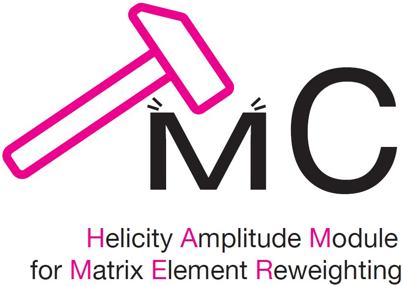

[](https://doi.org/10.5281/zenodo.3722681)
[](https://doi.org/10.5281/zenodo.20716678)

<p align="center">
  
</p>

# HAMMER  - Helicity Amplitude Module for Matrix Element Reweighting, ver. 2.0.0

A C++ software library, designed to provide fast and efficient reweighting of large Monte Carlo datasets containing semileptonic b-Hadron decays to any desired New Physics, or to any description of the hadronic matrix elements. See the [HAMMER website](https://hammer.physics.lbl.gov) for more information.

# Documentation

+ The HAMMER manual can be found [here](https://hammer.physics.lbl.gov/HammerManual.pdf).
+ Online code browser is available [here](https://hammer.physics.lbl.gov/code_browser).
+ Further documentation can be found on the HAMMER website.

# System Requirements

To use the latest [HAMMER](https://gitlab.com/mpapucci/Hammer/-/releases), you will need:

+ A C++17 compiler (See the [C++ compiler support](https://en.cppreference.com/w/cpp/compiler_support) status).  
   The following compilers have been tested for all functionalities (older versions may work without [Python bindings](#configure-options) and/or [ROOT integration](#configure-options))
  + GNU C++ Compiler at least v10.0
  + Clang C++ Compiler at least v17.0
+ [CMake](https://cmake.org/) at least v3.21
+ [Boost](https://boost.org/) libraries at least v1.75.00
+ [yaml-cpp](https://github.com/jbeder/yaml-cpp) library at least v0.6.0. If not available, HAMMER can install a [local copy](#configure-options)
+ If the [ROOT integration](#configure-options) is enabled:
  + [ROOT](https://root.cern), at least v6.25, compiled with the same C++ standard revision as the one used for HAMMER.
+ If the [Python bindings](#configure-options) are enabled:
  + Python at least v3.10. If the [ROOT integration](#configure-options) is enabled, the Python version should match the version used when building PyROOT.
  + If [ROOT integration](#configure-options) is enabled, by default HAMMER will use the ROOT-internal cppyy modules for building the Python bindings.
  + If ROOT is not present HAMMER will default to standalone [cppyy](https://cppyy.readthedocs.io).
  + For backward compatibility and as a fallback, the old deprecated API via [Cython](https://cython.org) bindings can be used by setting `PYTHON_USE_CPPYY=OFF`. If Cython is not available, HAMMER can install a [local copy](#configure-options).
  + If Cython is used, then the following packages are further required:
    + [cymove](https://github.com/ozars/cymove) module v1.00.00 (Cython mode only). If not available, HAMMER can install a [local copy](#configure-options)
    + [numpy](https://numpy.org) module. If not available, HAMMER can install a [local copy](#configure-options)
+ If the [examples](#configure-options) are installed:
  + [HepMC3](http://hepmc.web.cern.ch/hepmc/) at least v3.2.0. If not available, HAMMER can install a [local copy](#configure-options)
  + If Python is enabled, the Python examples will require either the HepMC3 internal bindings, or the package [pyhepmc](https://github.com/scikit-hep/pyhepmc). If none can be found, HAMMER will default to a (slower) internal HepMC parser.
+ If the [code documentation](#configure-options) is being built
  + [doxygen](http://www.doxygen.nl) with [graphviz](https://www.graphviz.org) and [LaTeX](https://www.latex-project.org) support.
  + [doxypypy](https://github.com/Feneric/doxypypy) module. If not available, HAMMER can install a [local copy](#configure-options)

# Installation

HAMMER uses [CMake](https://cmake.org/) to configure the build process.
Out-of-source build is required:

```bash
~$ tar -xzf Hammer-X.Y.Z-Source.tar.gz
~$ mkdir Hammer-build
~$ cd Hammer-build
~$ cmake -DCMAKE_INSTALL_PREFIX=../Hammer-install <ADDITIONAL_OPTIONS> ../Hammer-X.Y.Z-Source  # configure the project. See below for ADDITIONAL_OPTIONS
~$ make # compile the project
~$ ctest -V  # runs all the unit tests. Optional, to be called if tests are enabled
~$ make doc  # create the code documentation. Optional, to be called if documentation is enabled
~$ make install # install the project
```

# Configure Options

The following options can be passed to CMake at configure time with the usual `-D<OPTION_NAME>=ON|OFF` syntax.

| Option | Default | Description |
| ------- | ------ | ----------- |
| WITH_PYTHON | ON | Build the HAMMER Python3 bindings |
| PYTHON_USE_CPPYY | ON | Use cppyy for Python bindings (set to `OFF` to use Cython instead) |
| WITH_ROOT | OFF | Build the HAMMER ROOT interface |
| WITH_EXAMPLES | OFF | Build the HAMMER examples. The ROOT and Python examples will be built only if the corresponding options are enabled. All the examples will be located in `<INSTALL_DIR>/shared/Hammer/Examples` after installation |
| ENABLE_TESTS | OFF | Build the unit tests |
| BUILD_DOCUMENTATION | OFF | Allows building the `doxygen` documentation with `make doc` |
| INSTALL_HEADERS | OFF | Install all HAMMER development headers (Amplitudes, FormFactors, Rates, Math internals, and other internal headers). By default only the headers needed to compile against the public API are installed |
| INSTALL_EXTERNAL_DEPENDENCIES | OFF | Build and install local copies of certain missing dependencies. For missing Python modules a working `pip` is required |
| FORCE_YAMLCPP_INSTALL | OFF | Install local copy of `yaml-cpp` even if one is present (rarely needed). Useful on certain systems where package finding and `INSTALL_EXTERNAL_DEPENDENCIES` both fails |
| FORCE_HEPMC_INSTALL | OFF | Install local copy of `HepMC3` even if one is present (rarely needed). Useful on certain systems where package finding and `INSTALL_EXTERNAL_DEPENDENCIES` both fails |

furthermore, the following options are available for debugging

| Option | Default | Description |
| ------- | ------ | ----------- |
| VERBOSE_DEBUG | OFF | Build for debugging with high verbosity |
| SANITIZE | OFF | Enable AddressSanitizer and UndefinedBehaviorSanitizer (requires compiler support; implies `VERBOSE_DEBUG`) |
| COVERAGE | OFF | Enable code coverage reporting |

and the standard CMake option `-DBUILD_SHARED_LIBS=ON|OFF` controls whether Hammer is built as a static or dynamic library (static is default) and switching to shared library sometimes may be useful for resolving linking issues with the Boost Thread library on some platforms.

# Post-installation configuration

HAMMER installs `thishammer.{cssh,sh,fish}` scripts in `<install_dir>/bin`. They can be sourced to set up the look-up path environment variables for installations not in the standard location (analogously to `thisroot.sh` for ROOT).

# Compilation of user code against the HAMMER library

HAMMER will install CMake modules, allowing the library to be discovered by CMake via `find_package(Hammer REQUIRED)` and linked against by adding the necessary HAMMER targets via `target_link_link_libraries(<program_name> PRIVATE Hammer::Hammer)`. See the [manual] for more information.

# Examples

The folder `Examples/` contains several examples and is a great place to learn to use HAMMER.

+ C++ Examples:
  
| Example | Description |
| ------- | ----------- |
| [demo01](./Examples/demo01.cc) | read MC events, reweighs $`B\rightarrow (D^*\rightarrow D\pi) \tau\nu`$ and $`B\rightarrow D \tau \nu`$ from ISGW2 to BLPR for generalized NP, saving all the event NP tensor weights into a file |
| [demo02](./Examples/demo02.cc) | read in the output of demo01 and reweighs all the events from Standard Model to new physics with complex Wilson Coefficients $`S_{qLlL} = x i`$, $`T_{qLlL}= x/4`$ for $`x=0, 0.2, \ldots, 1.0`$, printing the values of the first few weights in each case |
| [demo03](./Examples/demo03.cc) | same reweighing as in demo01 but histograms are filled ($`p_\ell`$ vs $`Q^2`$, in 6-by-5 bins, separately for $`D`$ and $`D^*`$), including weight-squared uncertainties, and saved instead |
| [demo04](./Examples/demo04.cc) | read the output of demo03 and perform the same reweighing to new physics as demo02, printing the histogram bin values — weight, number of events, and weight-squared uncertainty |
| [demo05](./Examples/demo05.cc) | read MC events, reweighs $`B\rightarrow (D^*\rightarrow D\pi) \tau\nu`$, $`B\rightarrow D \tau \nu`$, $`B\rightarrow (D^*\rightarrow D\pi) \ell\nu`$ and $`B\rightarrow D \ell \nu`$ starting from pure phase space events. Prints total sum of weights reweighing decays with a $`\tau`$ to $`S_{qLlL} = x i`$, $`T_{qLlL}= x/4`$ and those with a $`\mu`$ to $`S_{qLlL} = -x i`$, $`T_{qLlL}= -x/4`$ for $`x=0, 0.2, \ldots, 1.0`$ |
| [demo07](./Examples/demo07.cc) | read MC events, reweighs $`B \rightarrow D \ell \nu`$ from ISGW2 to BGL with FF variations and fill histograms ($`Q^2`$ in 12 bins and $`p_\ell`$ vs $`Q^2`$ in 8-by-7 bins), including weight-squared uncertainties |
| [demo08](./Examples/demo08.cc) | read the output of demo07 and reweighs by varying the Form Factors with BGL parameters $`\delta a_1=x`$ and $`\delta a_2=x/3`$ with $`x=0.0,0.01,\ldots,0.05`$, printing out the histogram bin values for weight, number of events, and weight-squared uncertainty |
| [demo09](./Examples/demo09.cc) | same as demo03, but splits the event sample into two different output files |
| [demo10](./Examples/demo10.cc) | same as demo04, but merges the output files produced in demo09 (automatically summing histograms) |
| [demo11](./Examples/demo11.cc) | same as demo07, but renames the FF variation eigenvector directions |
| [demo12](./Examples/demo12.cc) | same as demo08, but renames the FF variation eigenvector directions, and processes the results of demo11 |
| [demo13](./Examples/demo13.cc) | same as demo03 but with Wilson Coefficient specialization enabled |
| [demo13rl](./Examples/demo13rl.cc) | reload weights and specializations to fill histograms |
| [demo14](./Examples/demo14.cc) | same output as demo04 but with WC specialization. Read demo03/13 output and compare histograms and timing with and without specialization |
| [demo01root](./Examples/demo01root.cc) | same as `demo01` but using ROOT `TTree` for storage |
| [demo02root](./Examples/demo02root.cc) | same as `demo02` but using ROOT `TTree` for storage |
| [demo03root](./Examples/demo03root.cc) | same as `demo03` but using ROOT `TTree` for storage and `TH2D` for histograms |
| [demo04root](./Examples/demo04root.cc) | same as `demo04` but using ROOT `TTree` for storage and `TH2D` for histograms |
| [demo04root2](./Examples/demo04root2.cc) | alternative implementation of `demo04root` |
| [demo01card](./Examples/demo01card.cc) | same as `demo01` but using a card file to set the run options |
| [demo04mma](./Examples/demo04mma.cc) | same as `demo04` but with Wilson Coefficient values passed from the command line (to be called from `Mathematica`) |
| [demo08mma](./Examples/demo08mma.cc) | same as `demo08` but with Wilson Coefficient values passed from the command line (to be called from `Mathematica`) |
| [demo04parallel](./Examples/demo04parallel.cc) | same as `demo04` but using multi-threading |

+ Python Examples (with ROOT/cppyy bindings):
  
| Example | Description |
| ------- | ----------- |
| [demo01.py](./Examples/demo01.py) | Python version of `demo01` |
| [demo01root.py](./Examples/demo01root.py) | Python version of `demo01root` |
| [demo01_io.py](./Examples/demo01_io.py) | Python version of `demo01` using the Python I/O |
| [demo02.py](./Examples/demo02.py) | Python version of `demo02` |
| [demo03.py](./Examples/demo03.py) | Python version of `demo03` |
| [demo04.py](./Examples/demo04.py) | Python version of `demo04` |

+ Python Examples (old API with Cython bindings):
  
| Example | Description |
| ------- | ----------- |
| [demo01_cython.py](./Examples/demo01_cython.py) | Python version of `demo01` |
| [demo02_cython.py](./Examples/demo02_cython.py) | Python version of `demo02` |
| [demo03_cython.py](./Examples/demo03_cython.py) | Python version of `demo03` |
| [demo04_cython.py](./Examples/demo04_cython.py) | Python version of `demo04` |

# Contributors

Hammer has been developed by:

+ Florian U. Bernlochner
+ Stephan Duell
+ Zoltan Ligeti
+ Michele Papucci
+ Dean J. Robinson

Current contributors can be found [here](https://gitlab.com/mpapucci/Hammer/-/graphs/master).

# License

Hammer is licensed under [version 3 of the GPL](./COPYING).
Please note the [MCnet](./GUIDELINES) academic guidelines.

# Keeping in touch

+ Report bugs using the [issue tracker](https://gitlab.com/mpapucci/Hammer/-/issues) (or [email us](mailto:hammer-support@lbl.gov))
+ Check and subscribe to the [announcements](https://groups.google.com/d/forum/hammer-announce/join)
